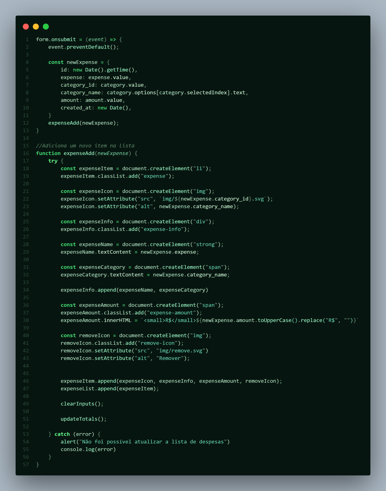

 # Refund Template

Este projeto é um fork do projeto **Refund** desenvolvido pela [Rocketseat](https://github.com/rocketseat-education/refund-template).

O objetivo do projeto é servir como template para uma aplicação de solicitação e gerenciamento de reembolsos, permitindo o registro de despesas e o acompanhamento das solicitações.

## Repositório original

Este repositório foi criado a partir do projeto da Rocketseat:

<https://github.com/rocketseat-education/refund-template>

## Tecnologias

- HTML
- CSS
- JavaScript

## Como executar

1. Clone este repositório:

	```bash
	git clone <URL-DESTE-REPOSITORIO>
	```

2. Acesse a pasta do projeto:

	```bash
	cd refund-template
	```

3. Abra o arquivo `index.html` no navegador ou utilize uma extensão como o Live Server.

## Licença

Este projeto é baseado no material disponibilizado pela Rocketseat. Consulte o repositório original para obter informações sobre licença e uso.
